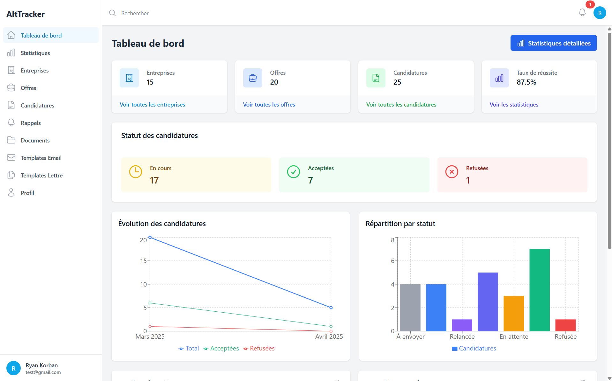
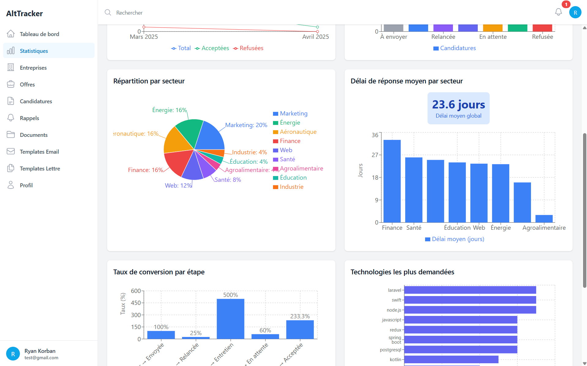
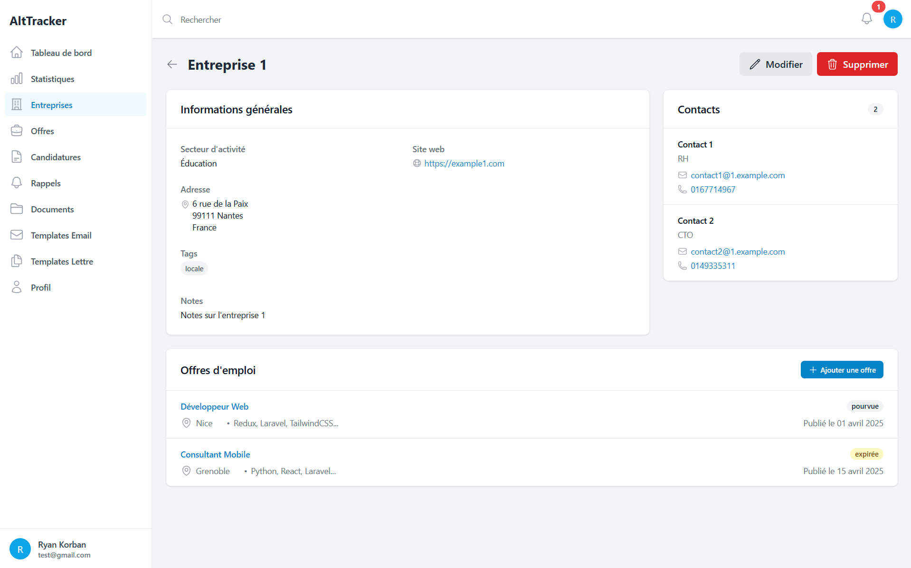
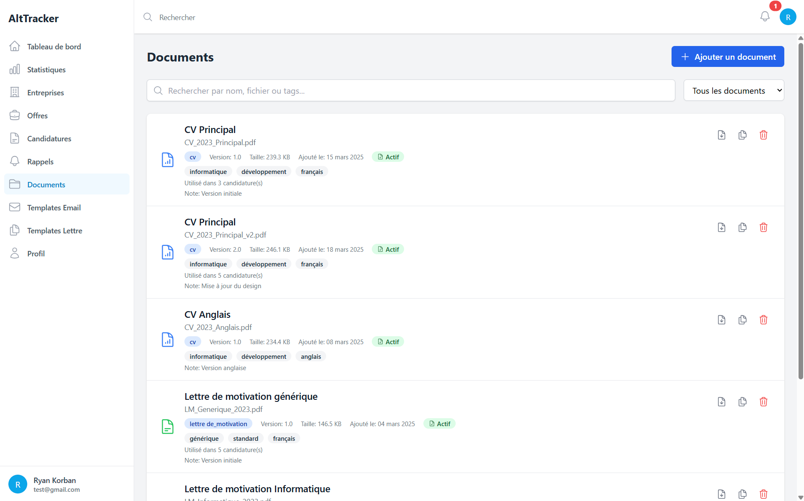
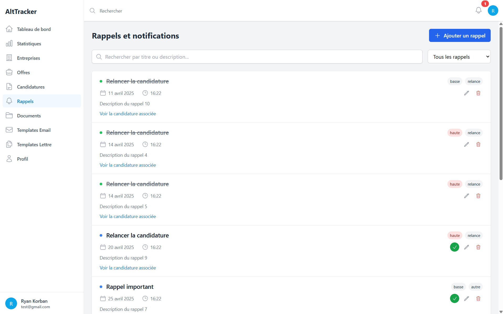

# AltTracker

<div align="center">
  
  <h3>Un système de suivi de candidatures</h3>

[](https://opensource.org/licenses/MIT)
[](https://reactjs.org/)
[](https://nodejs.org/)
[](https://www.mongodb.com/)
</div>

## 🚀 À propos

AltTracker est une application web qui simplifie ta recherche de stage ou d'alternance. Elle te permet de garder un œil sur toutes tes candidatures, de gérer ta liste d'entreprises et d'offres auxquelles tu veux/vas postuler, et de voir clairement où tu en es grâce à des stats et des graphiques. En gros, c'est l'outil parfait pour t'organiser quand tu cherches un stage ou une alternance.

## ✨ Fonctionnalités

### 📊 Tableau de bord personnalisable
- Vue d'ensemble de votre recherche d'alternance
- Indicateurs clés de performance
- Taux de conversion par étape du processus

### 📝 Gestion des candidatures
- Suivi complet avec statuts personnalisables
- Timeline détaillée des interactions
- Organisation centralisée des documents
- Planification des relances et des entretiens

### 🏢 Base de données des entreprises et offres
- Gestion des contacts par entreprise
- Catégorisation par secteur et technologie
- Priorisation des offres selon vos critères

### 📈 Analyse et statistiques avancées
- Visualisations interactives de vos progrès
- Identification des canaux les plus efficaces
- Analyses par secteur et compétences demandées

### 🛠️ Outils intelligents
- Templates d'emails et de lettres de motivation
- Intégration Gmail pour l'envoi direct depuis l'application
- Système de rappels et notifications
- Import/export de données (CSV, Excel, JSON)

## 🖥️ Captures d'écran

<div align="center">
    
    
    
    
    
</div>

## 🔧 Technologies utilisées

### Frontend
- **React** - Bibliothèque UI moderne et réactive
- **Tailwind CSS** - Framework CSS utilitaire
- **Recharts** - Bibliothèque de visualisation de données
- **Formik & Yup** - Gestion avancée des formulaires
- **React Router** - Navigation fluide entre les pages
- **Axios** - Client HTTP pour les requêtes API

### Backend
- **Node.js** - Runtime JavaScript côté serveur
- **Express** - Framework web minimaliste et flexible
- **MongoDB** - Base de données NoSQL avec Mongoose
- **JWT** - Authentification sécurisée
- **Multer** - Gestion des téléchargements de fichiers
- **Google API** - Intégration avec Gmail

## 📦 Installation

### Prérequis
- Node.js (v14+)
- MongoDB (v4+)
- Compte Google (pour l'intégration Gmail)

### Étapes d'installation

1. **Cloner le dépôt**
   ```bash
   git clone https://github.com/korban2u/alternance-tracker.git
   cd alternance-tracker
   ```

2. **Installer les dépendances**
   ```bash
   # Installation complète (client + serveur):
   npm run install-all
   ```

3. **Configuration**
   - Créer un fichier `.env` dans le dossier `server` avec:
   ```
   PORT=5000
   MONGO_URI=mongodb://localhost:27017/alternance-tracker
   JWT_SECRET=votre_secret_jwt_sécurisé
   NODE_ENV=development
   GOOGLE_CLIENT_ID=votre_client_id
   GOOGLE_CLIENT_SECRET=votre_client_secret
   GOOGLE_REDIRECT_URI=http://localhost:5000/api/gmail/auth/callback
   ```

4. **Démarrer l'application**
   ```bash
   npm start
   ```

5. **Accéder à l'application**
   - Ouvrez votre navigateur et accédez à `http://localhost:3000`

## 📁 Structure du projet

```
alternance-tracker/
├── client/                      # Frontend React
│   ├── public/                  # Fichiers statiques
│   ├── src/
│   │   ├── components/          # Composants réutilisables
│   │   ├── context/             # Context API
│   │   ├── pages/               # Pages de l'application
│   │   ├── services/            # Services d'API et utilitaires
│   │   └── ...
│   └── ...
│
├── server/                      # Backend Node.js/Express
│   ├── controllers/             # Contrôleurs pour chaque entité
│   ├── models/                  # Modèles MongoDB
│   ├── routes/                  # Routes API
│   ├── middleware/              # Middleware
│   ├── uploads/                 # Dossier pour les fichiers uploadés
│   └── ...
│
└── ...
```

## 🔌 API Routes

### Authentification
| Méthode | Route | Description |
|---------|-------|-------------|
| POST | `/api/users/register` | Inscription utilisateur |
| POST | `/api/users/login` | Connexion utilisateur |
| GET | `/api/users/profile` | Obtenir le profil utilisateur |
| PUT | `/api/users/profile` | Mettre à jour le profil |

### Entreprises
| Méthode | Route | Description |
|---------|-------|-------------|
| GET | `/api/companies` | Liste des entreprises |
| POST | `/api/companies` | Créer une entreprise |
| GET | `/api/companies/:id` | Détails d'une entreprise |
| PUT | `/api/companies/:id` | Mettre à jour une entreprise |
| DELETE | `/api/companies/:id` | Supprimer une entreprise |

### Offres
| Méthode | Route | Description |
|---------|-------|-------------|
| GET | `/api/offers` | Liste des offres |
| POST | `/api/offers` | Créer une offre |
| GET | `/api/offers/:id` | Détails d'une offre |
| PUT | `/api/offers/:id` | Mettre à jour une offre |
| DELETE | `/api/offers/:id` | Supprimer une offre |

### Candidatures
| Méthode | Route | Description |
|---------|-------|-------------|
| GET | `/api/applications` | Liste des candidatures |
| POST | `/api/applications` | Créer une candidature |
| GET | `/api/applications/:id` | Détails d'une candidature |
| PUT | `/api/applications/:id` | Mettre à jour une candidature |
| DELETE | `/api/applications/:id` | Supprimer une candidature |
| POST | `/api/applications/:id/timeline` | Ajouter une entrée timeline |


## 📄 Licence

Ce projet est sous licence MIT - voir le fichier [LICENSE](LICENSE) pour plus de détails.

---

## 👤 Auteur

**Ryan Korban**